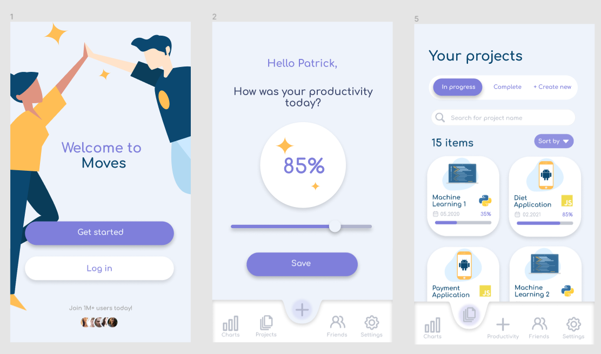
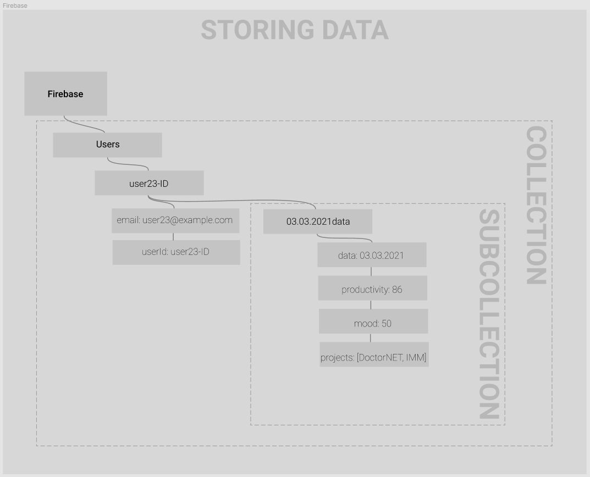

# **Moves**

The Moves app was created with productivity in mind. Have you ever found yourself not being motivated enough to complete side projects? With Moves, you'll be able to add your own projects and compare your productivity scores with your friends so you can motivate each other.

## Concept
Below is the concept of the application, of course a lot can change in the future, but this is our starting point.

Below is the UI/UX concept of the app:

## Firebase
In order to provide support for multiple devices we will use Firebase tools, additionally thanks to this solution, we will be able to implement social features easily and pleasantly. 
### *Data Storing*
The following is a flowchart of the FireStore server's data persistence on Firebase.

